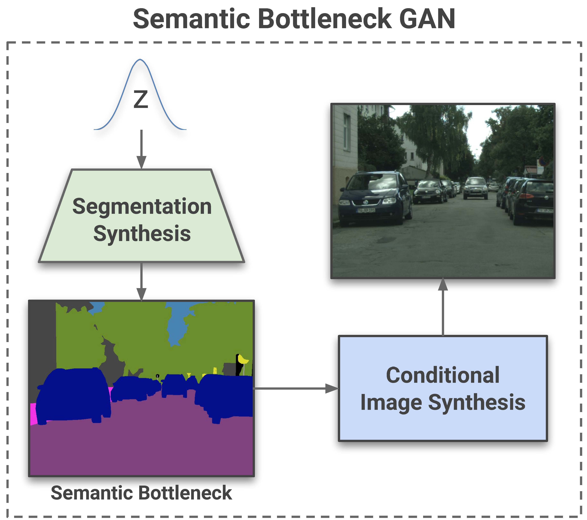
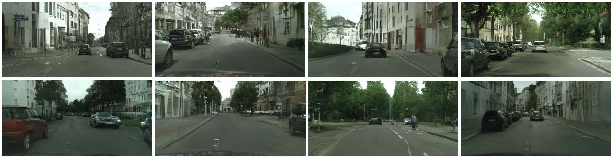

# SB-GAN
<!--  -->
<center><h2>Semantic Bottleneck Scene Generation</h2></center>

Coupling the high-fidelity generation capabilities of label-conditional image synthesis methods with the flexibility of unconditional generative models, we propose a semantic bottleneck GAN model for unconditional synthesis of complex scenes. We assume pixel-wise segmentation labels are available during training and use them to learn the scene structure. During inference, our model first synthesizes a realistic segmentation layout from scratch, then synthesizes a realistic scene conditioned on that layout. For the former, we use an unconditional progressive segmentation generation network that captures the distribution of realistic semantic scene layouts. For the latter, we use a conditional segmentation-to-image synthesis network that captures the distribution of photo-realistic images conditioned on the semantic layout. When trained end-to-end, the resulting model outperforms state-of-the-art generative models in unsupervised image synthesis on two challenging domains in terms of the Frechet Inception Distance and user-study evaluations. Moreover, we demonstrate the generated segmentation maps can be used as additional training data to strongly improve recent segmentation-to-image synthesis networks.

<table align=center width=850px>
  <center><h1>Paper</h1></center>
  <tr>
  <td width=400px align=center>
  <!-- <p style="margin-top:4px;"></p> -->
  <a href="https://people.eecs.berkeley.edu/~sazadi/SBGAN/main.pdf"></a>
  <center>
  <span style="font-size:20pt"><a href="https://people.eecs.berkeley.edu/~sazadi/SBGAN/main.pdf">[Paper 3.5MB]</a>&nbsp;
  <span style="font-size:20pt"><a href="https://arxiv.org/abs/1911.11357">[arXiv]</a>
  </center>
  </td>
  </tr>
  </table>
<center><h1>Code</h1></center>

## Prerequisites:
- NVIDIA GPU + CUDA CuDNN
- Python 3.6
- PyTorch 1.0
- Please install dependencies by
```
pip install -r requirements.txt
```

## Preparation
- Clone this repo with its submodules
```
git clone --recurse-submodules -j8 https://github.com/azadis/SB-GAN.git
cd SB-GAN/SPADE/models/networks/
git clone https://github.com/vacancy/Synchronized-BatchNorm-PyTorch
cp -rf Synchronized-BatchNorm-PyTorch/sync_batchnorm .
cd ../../../../
```

## Datasets
### ADE-Indoor
- To have access to the indoor images from the <a href="https://groups.csail.mit.edu/vision/datasets/ADE20K/">ADE20K dataset</a> and their corresponding segmentation maps used in our paper:

```
cd SB-GAN
bash SBGAN/datasets/download_ade.sh
cd ..
```

### Cityscapes 
```
cd SB-GAN/SBGAN/datasets
mkdir cityscapes
cd cityscapes
```
- Download and unzip leftImg8bit_trainvaltest.zip and gtFine_trainvaltest.zip from the <a href="https://www.cityscapes-dataset.com/downloads/">Cityscapes webpage </a>.
```
mv leftImg8bit_trainvaltest/leftImg8bit ./
mv gtFine_trainvaltest/gtFine ./
```

**Cityscapes-25k**
- In addition to the 5K portion already downloaded, download and unzip leftImg8bit_trainextra.zip. You can have access to the fine annotations of these 20K images we used in our paper by:
```
wget https://people.eecs.berkeley.edu/~sazadi/SBGAN/datasets/drn_d_105_000_test.tar.gz
tar -xzvf drn_d_105_000_test.tar.gz
```
These annotations are predicted by a <a href="https://github.com/fyu/drn">DRN</a> trained on the 5K fine-annotated portion of Cityscapes with 19 semantic categories. The new fine annotations of the 5K portion with 19 semantic classes can be also downloaded by:
```
wget https://people.eecs.berkeley.edu/~sazadi/SBGAN/datasets/gtFine_new.tar.gz
tar -xzvf gtFine_new.tar.gz
cd ../../../..
```
## Training
```cd SB-GAN/SBGAN```
- On each ```$dataset``` in ```ade_indoor, cityscapes, cityscapes_25k```:
1. Semantic bottleneck synthesis:
```
bash SBGAN/scipts/$dataset/train_progressive_seg.sh
```
2. Semantic image synthesis:
```
cd ../SPADE
bash scripts/$dataset/train_spade.sh
```
3. Train the end2end SBGAN model:
```
cd ../SBGAN
bash SBGAN/scripts/$dataset/train_finetune_end2end.sh
```
- In the above script, set $pro_iter to the iteration number of the checkpoint saved from step 1 that you want to use before fine-tuning. Also, set $spade_epoch to the last epoch saved for SPADE from step 2.
- To visualize the training you have started in steps 1 and 3 on a ${date-time}, run the following commands. Then, open ```http://localhost:6006/``` on your web browser.
```
cd SBGAN/logs/${date-time}
tensorboard --logdir=. --port=6006
```

## Testing
To compute FID after training the end2end model, for each $dataset, do:
```
bash SBGAN/scripts/$dataset/test_finetune_end2end.sh
```
- In the above script, set $pro_iter and $spade_epoch to the appropriate checkpoints saved from your end2end training.

## Citation
If you use this code, please cite our paper:
```
@article{azadi2019semantic,
  title={Semantic Bottleneck Scene Generation},
  author={Azadi, Samaneh and Tschannen, Michael and Tzeng, Eric and Gelly, Sylvain and Darrell, Trevor and Lucic, Mario},
  journal={arXiv preprint arXiv:1911.11357},
  year={2019}
}
```
